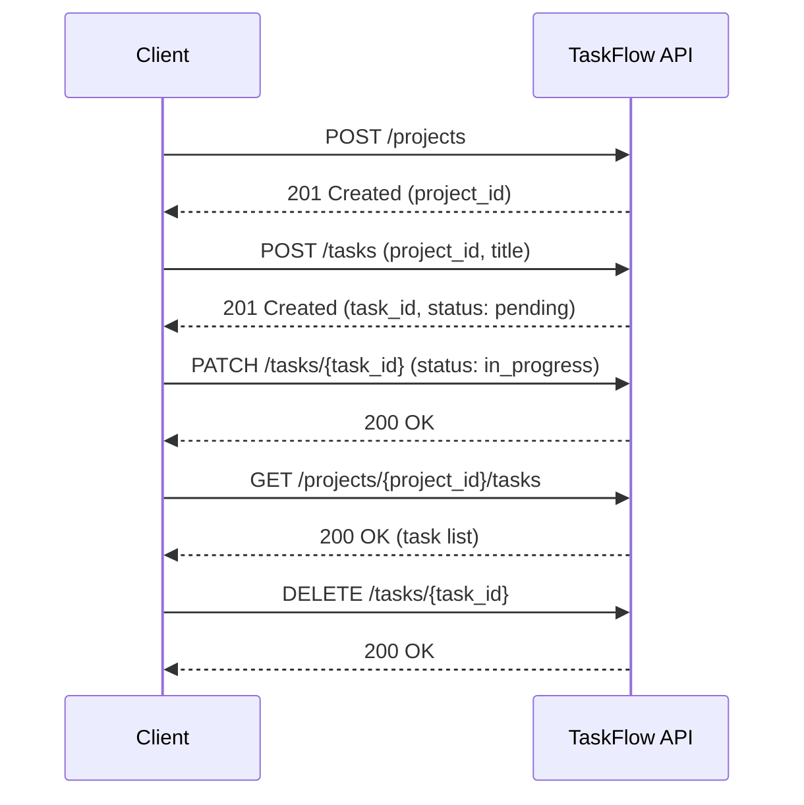

TaskFlow has only two resources — projects and tasks — but they're not independent. Understanding this dependency up front will save you time debugging `404` errors later.

## The dependency chain

<Steps>
  <Step title="Create a project">
    `POST /projects` with a `name` (required) and an optional `description`.

    The response returns a `project_id`. This is the only way to get a valid `project_id` — you cannot create tasks without one.
  </Step>
  <Step title="Create tasks inside that project">
    `POST /tasks` with the `project_id` from step 1 and a `title`.

    Every task is created with a default status of `pending`. The response returns a `task_id`.
  </Step>
  <Step title="Read, update, or delete tasks using their task_id">
    - `GET /projects/{project_id}/tasks` — list every task in a project
    - `PATCH /tasks/{task_id}` — update a task's title, description, or status
    - `DELETE /tasks/{task_id}` — permanently remove a task
  </Step>
</Steps>

## Why order matters

Every task belongs to exactly one project. If you call `POST /tasks` with a `project_id` that doesn't exist yet, the API doesn't create an orphaned task — it rejects the request:

```json
{
  "error": "Not Found",
  "message": "No project found with project_id 'abc123'. Create a project first using POST /projects."
}
```

The same logic applies to tasks: `PATCH /tasks/{task_id}` and `DELETE /tasks/{task_id}` both require a `task_id` that already exists. There's no endpoint to "list all tasks across every project" — task visibility is always scoped to a project, which reinforces that projects come first.

## Task status values

A task's `status` field accepts exactly three values:

| Status | Meaning |
|---|---|
| `pending` | Default status for a newly created task. Nothing has started yet. |
| `in_progress` | Work on the task is actively underway. |
| `done` | The task is complete. |

Sending any other value to `PATCH /tasks/{task_id}` returns a `400 Bad Request`. See [Task Status](/guides/task-status) for more on managing status transitions.

## Deleting tasks

`DELETE /tasks/{task_id}` is permanent — there's no way to recover a deleted task through the API. There's currently no endpoint to delete a project directly; if you need to retire a project, delete its tasks individually first.

## Putting it together

A typical integration follows this sequence:



For working code examples of each of these calls, see the [Quickstart](/quickstart).
